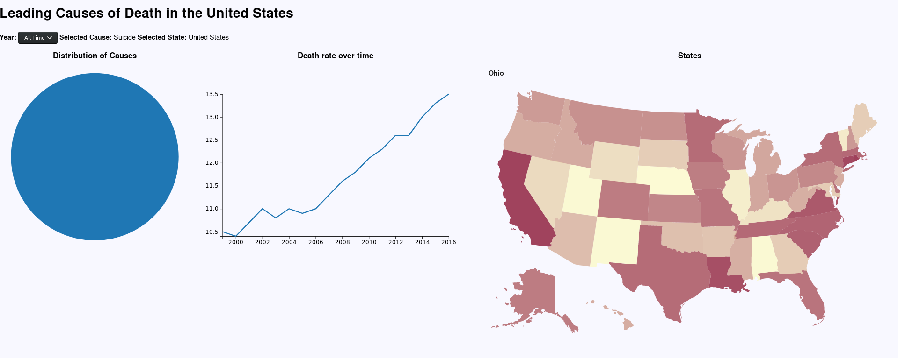

# BDV3 - D3 Project

Dominik Reitberger, Michael Öller

## Dataset

The dataset we visualise in this project consists of the leading causes of death in the United States from 1999 - 2016.
It contains 10296 items with the following attributes:

| Feature | Description | Class |
| ------- | ----- | ---- |
| Year | the year in which the deaths occured | ordinal |
| 113 Cause Name | Name of the cause of death as in ICD-10 | nominal |
| Cause Name | General name of the cause of death | nominal |
| State | State where the deaths occured | nominal |
| Deaths | Nr. of deaths | quantitative |
| Age-adjusted Death Rate | Nr. of deaths per population, adjusted to the age | quantitative |

## Questions

Questions we came up with are i.e.:

* What is the main cause of death?
* How do death rates change over the years?
* Are there any differences when looking at single states?

## Visual Design and Changes

The visual design of our project consists of three visualisations which are all interconnected:

* a pie chart showing the distribution of the causes of death
* a line chart showing the death rate changing over time
* a map enabling users to select a specific state

Initially our project shows visualisations of the dataset for the entire US over all time.
A combobox above the visualisations can be used to select a specific year which will trigger an update of the visualization, where the line chart obviously shows nothing, as there is no trend to show.

Interaction with the visualisation can be done by clicking either a cause in the pie chart, a line in the line chart or the desired state in the map, which will al trigger an update.

## Insights

In the United States in general, as well as in every specific state, *Heart Disease* and *Cancer* are the two main causes of death.

Although on the overall view of the trend there is not that much to see for the other causes, looking at specific causes in particular gives better insight.

We can e.g. see that death by suicide is on the rise in the US:

An interesting insight is that apparently there must have been some medical breakthrough in the area of kidney diseases in 2011, as the death rate rapidly decreased:

